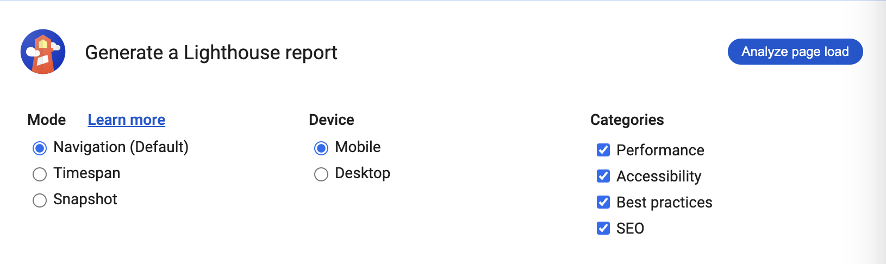

# Exercise 6: Coding Best Practices

## Objectives

This exercise is designed to strengthen your ability to analyze, think critically, and resolve coding issues. You will perform a website performance test, research the results, and write an analysis. Then, you’ll build and style a simple 3-page website to showcase your findings. The exercise focuses equally on the quality of your content and the standard of your coding.

_See examples of what your finished pages could look like in the repo's "examples" folder._

## Instructions

### Get set up

- Clone your remote exercise repository onto your local machine.

**Tips:**

- Make proper Git commits.
- Fix the errors as they occur in your code and make the most of the tools available to you:
  1. Highlight errors. Note: If the debugger is not working then you may be in restricted mode and need to turn on Workspace Trust. Click on the Manage Gear button at the bottom of the screen on the left-hand side, then select Manage Workspace Trust to switch between Trusted and Restricted modes.
  2. Use the Prettier extension to help you format your code.
  3. Regularly save your files and check out what your web page looks like in a web browser as you code. Use the Chrome Developer Tools: Open index.html in Chrome, right-click > Inspect.

### Step 1: Choose and test a website

Choose any website you like, and try out the two launch tasks below:

1. Go to https://wave.webaim.org and enter your chosen website's URL in the web address field to check the accessibility of the website. Check out all the accessibility errors and alerts in the Details tab. Take a screenshot and save it in a folder called images in your repo.
2. In Chrome, on the website's homepage, open the Developer Tools. Go to the Lighthouse tab, leave all settings as they are and click "Analyze page load". Take a screenshot and save it in a folder called images in your repo.
   

### Step 2: Build a website to document the testing

Create a 3-page website from scratch, no HTML code has been provided. Make sure that your HTML is clean, error-free and semantic (don't use any div elements unless you absolutely have to)! Your website will include the following content:

**Page 1: Homepage:**

1. Header with navigation
2. Link to the website URL
3. Brief explanation of the what the website is and why you chose it
4. A screenshot of the homepage of the website that opens the full-size image of the homepage in a new browser tab when the user clicks on it
5. Summary of the test results with navigation links that take the visitor to the Accessibility and Lighthouse Report pages.
6. Footer

**Page 2: Accessibility:**

1. Header with navigation
2. Summary of accessibility findings
3. A screenshot of the homepage WAVE test results that opens the full-size image in a new browser tab when the user clicks on it
4. Detailed explanations of the findings. Pick 2 or three issues from the WAVE Report, research and explain what the problems are, why they matter, and how the issues can be fixed.
   - Pick issues that are not in the provided examples.
   - Be specific and make sure that your explanations are directy relevant to the code. Don't offer generic explanations. You will need to examine the website's code with the Browser Developper Tools, quote the code if you can.
5. Footer

**Page 3: Lighthouse Report:**

1. Header with navigation
2. Summary of Lighthouse Report findings
3. A screenshot of the Lighthouse report that opens the full-size image in a new browser tab when the user clicks on it
4. Detailed explanations of the findings. Pick 2 or three issues from the Lighthouse Report, research and explain what the problems are, why they matter, and how the issues can be fixed.
   - You can also test your website with https://tools.pingdom.com/ as you might find that the results are easier to understand than the Lighthouse Performance Results.
   - Pick issues that are not in the provided examples.
   - Be specific and make sure that your explanations are directy relevant to the code. Don't offer generic explanations. You will need to examine the website's code with the Browser Developper Tools, quote the code if you can.
5. Footer

### Step 3: Style your website

Put some effort into styling your content and make your content look well-structured and easy to read. All your CSS must be in one external stylesheet, it must be organized into sections using comments, and it must be efficient. At the very least, you must include the following:

- a Google font
- the 62.5% trick
- display properties: (inline, inline-block or block)
- box model properties: padding, margin, border, background, border-radius, box-shadow, width
- text formatting properties: font-family, font-weight, font-size, text-decoration, color

### Step 4: Format, add comments, and check for errors

- Use the Prettier VSCode extension to format HTML and CSS code.
- Add a few comments to explain your HTML and CSS code and highlight anything of interest.
- Validate each HTML page to make sure that it is correct: https://validator.w3.org/#validate_by_upload. Take screenshots of the results.
- Validate your CSS code to make sure that it is correct: https://jigsaw.w3.org/css-validator/ for CSS. Take a screenshot of the results.

**You have now completed your exercise but you still need to push your edits to GitHub and submit it in Brightspace. Make sure to follow the instructions in the How to Complete Your Exercises Guide.**
